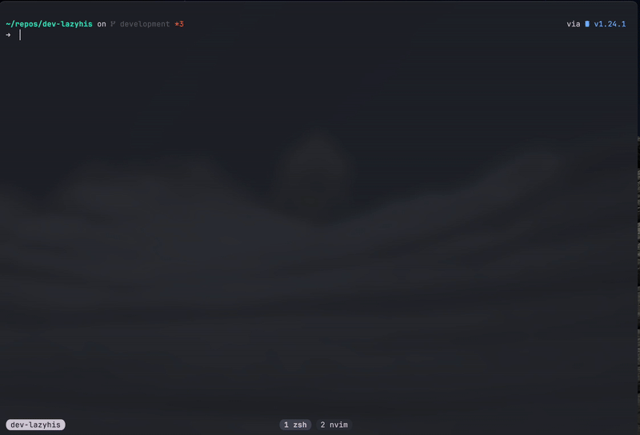

# LazyHis

A simple terminal UI for shell history, written in [Go](https://github.com/golang/go)!

[](github-release)
[](github-last-commit)
[](githut-commits-since)


<p align="center">
  
</p>

<!-- ## Why LazyHis? -->

<!-- LazyHis focuses on simplicity, speed, and a clean terminal UI. -->

<!-- - 🚀 **Fast**: Written in Go for maximum performance. -->
<!-- - 🎨 **Customizable**: Supports themes and keybindings. -->
<!-- - 🔍 **Powerful**: Advanced filtering, fuzzy search, and shell integration. -->

## Table of contents

- [Quick Install](#quick-install)
  - [Homebrew](#homebrew)
  - [Build from Source](#build-from-source)
  - [Configure zsh](#configure-zsh)
- [Feature Roadmap](#feature-roadmap)
- [Customization](#customization)
- [Alternatives](#alternatives)

## Quick Install

### 1. Install the lazyhis binary:

#### With [Homebrew](https://brew.sh) (Recommended)

```sh
brew tap nobbmaestro/homebrew-tap
brew install lazyhis
```

#### Build from Source

```sh
git clone git@github.com:nobbmaestro/lazyhis.git
cd lazyhis
make
```

### 2. Add the init script to your shell's config file:

#### Zsh

Add the following to the end of ~/.zshrc:

```sh
# ~/.zshrc

eval "$(lazyhis init zsh)"
```

## Feature Roadmap

- [ ] Add doctor CLI command for verifying shell configuration
- [ ] Add export CLI command for exporting to HISTFILE
- [ ] Add generate shell-completions CLI command
- [x] Add prune CLI command for removing history based on ignore pattern
- [ ] Copy to clipboard via GUI
- [ ] Customizable GUI theme
- [x] Customizable command exclusion by patterns
- [x] Customizable command exclusion by prefix
- [ ] Customizable keybindings
- [ ] Delete history entries via GUI
- [ ] Delete selected history entries via GUI
- [ ] Edit history entries via GUI
- [ ] Filter history by context via GUI
- [ ] Fuzzy-finder search strategy in GUI
- [ ] Support for inline GUI mode

## Customization

Check out the [configuration docs](docs/config.md).

## Alternatives

If `lazyhis` isn't quite what you're looking for, you might prefer:

- [Atuin](https://github.com/atuinsh/atuin)
